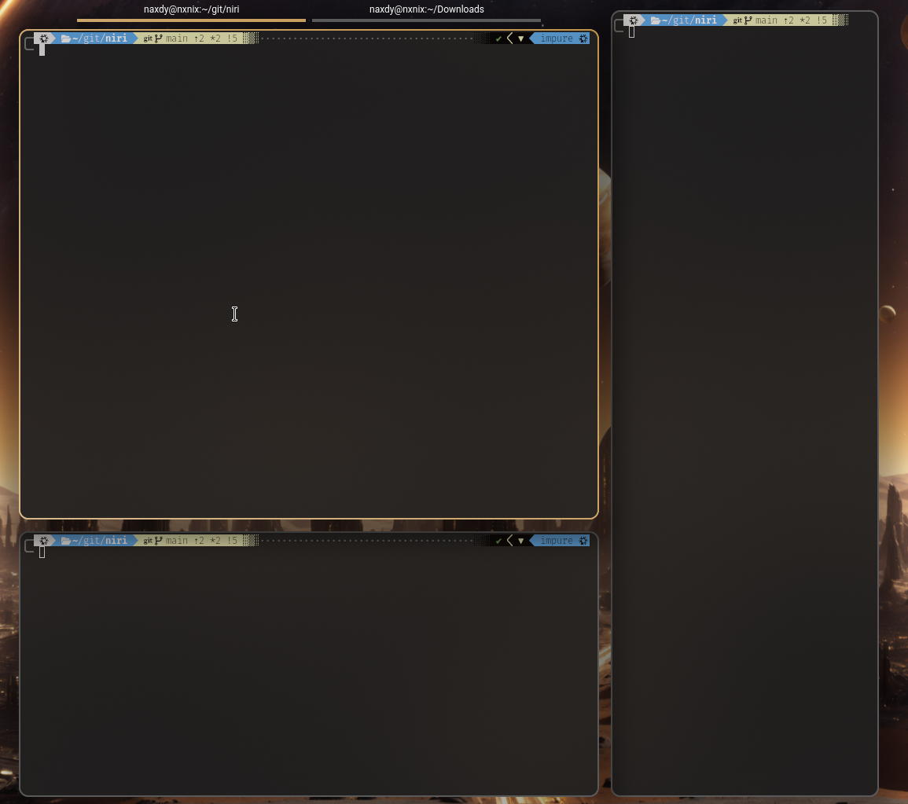

# niri (fork)

This repo houses a fork of niri, a scrollable tiling Wayland compositor. I mostly created it for my personal use, to bring few changes that are not yet upstream. This readme outlines the differences between this fork and upstream niri. For more info on upstream's version, check out
the original repository: https://github.com/YaLTeR/niri.
<br><br>

## Performance
This fork fixes the performance issues with native wayland apps and PROTON_USE_WAYLAND=1 on a hardware which uses Intel GPU to output video and Nvidia GPU to render, so most of the laptops with hybrid graphics.


<br><br>

## Blur behind windows and window groups
Brings blur behind windows and window groups (Naxdy's implementation https://github.com/Naxdy/niri)


<br><br>

## Center multiple columns
Improves always-center-single-column option to center any number of columns as long as they take less than a full screen width. Especially useful on ultrawide screens.

Video preview:

[](https://www.youtube.com/watch?v=DDytn7EgzjY)
<br><br>

## Release and modifier only keybinds
Merges a working implementation of release keybinds (https://github.com/YaLTeR/niri/pull/2456), so you can run app launcher by only pressing Super key. Allows muting microphone in push-to-talk like way, and many more. 

Example:
```
Mod release=true { spawn "dms" "ipc" "spotlight" "toggle"; }
KP_Insert { spawn-sh "wpctl set-mute @DEFAULT_AUDIO_SOURCE@ 0"; }
KP_Insert release=true allow-invalidation=false  { spawn-sh "wpctl set-mute @DEFAULT_AUDIO_SOURCE@ 1"; }
```
<br>

## Backward compatibility
This fork works with standard niri config out of the box. You can also create separate config file that features only changes available in this fork and include it in config.kdl, so any time you decide to return to upstream niri, just comment out the include.

For the maximum feature set, create a config file: `.config/niri/unofficial.kdl` and include it in your config.kdl:
```
layout {
  always-center-single-column

  blur {
    on
    noise 0.1
    passes 2
    radius 5
  }
}

window-rule {
  blur {
    on

    // instead of using `geometry-corner-radius`, you can also
    // define an alpha value here; anything that is more transparent than this
    // value will not be blurred.
    //
    // note that this will require rendering the blurred surface twice, so if possible,
    // prefer using `geometry-corner-radius` instead, for performance reasons.
    ignore-alpha 0.45

    // will render "x-ray" blur that is only based on `bottom` and `background` layer surfaces,
    // even if the window is floating. good for minimal GPU load.
    x-ray true
  }
}
```

> [!NOTE]
>
> Blur has to be enabled on a per-window or per-layer basis, i.e. setting `layout { blur { on } }` does nothing.

This fork also partially implements the [KDE blur](https://wayland.app/protocols/kde-blur) protocol, meaning that
certain KDE apps such as plasmashell or krunner are capable of blurring themselves natively, given that you've defined
nonzero `radius` and `passes` for blur elsewhere in your config. This doesn't require you to set `blur { on }` in your
window / layer rules, but having `blur { off }` will disable this behavior entirely.

However, this fork lacks the ability to more granularly define blur region, which will likely result in oversized blur.
To mitigate this, it is recommended to set `ignore-alpha` in your config. Below you'll find a config for sensible blur
defaults:

```kdl
layout {
  blur {
    // removes banding and gives it a "glassy" look
    noise 0.04
    passes 4
    radius 12
  }
}

layer-rule {
  match namespace="dms:bar"
  blur {
    ignore-alpha 0.8
    // use optimized blur for layer surfaces by default, to reduce GPU load
    x-ray true
  }
}
```

#### Caveats

- True blur currently only works for horizontal monitor configurations. When using any sort of 90 or 270 degree
  transformations, only x-ray blur will be available.
- True blur may exhibit some artifacts when rendered above a particularly active surface (e.g. a video player), due to
  the way its performance optimizations are handled. This will be addressed in the future.
- True blur will incur a significant performance cost when rendered behind a window that updates frequently, e.g.
  because it's being moved / resized often.
- Blur is currently only possible to be enabled through the config outside of KDE apps. Implementing the
  [background effect](https://wayland.app/protocols/ext-background-effect-v1) protocol is planned though.

### Window Groups (Tabbed Tiles)

Tiles can be turned into grouped tiles via the `toggle-group` action. Other windows can then be moved into our out of a
group via the `move-window-into-or-out-of-group` action, that accepts a directional parameter. Tabs can be cycled via
the `focus-next-window` and `focus-previous-window` actions. Example config:

```kdl
binds {
  Mod release=true { spawn "dms" "ipc" "spotlight" "toggle"; }

  Alt+G {
    toggle-group
  }
  Alt+Shift_L release=true {
    focus-next-window
  }
  //Mod+Shift+H {
  //  move-window-into-or-out-of-group "left"
  //}
  //Mod+Shift+L {
  //  move-window-into-or-out-of-group "right"
  //}
  Alt+Shift+Up {
    move-window-into-or-out-of-group "up"
  }
  Alt+Shift+Down {
    move-window-into-or-out-of-group "down"
  }
}

```
<br>

## Disclaimer
These changes are not well tested, they work on my PC. It might result in worse performance with other hardware configurations and it might break with different monitor layouts / scaling. I am not a rust programmer, so if it doesn't work for you then don't use it or fix it yourself. Most of the changes made here are other people's work that I just pulled together. I am not responsible for any damage caused by this fork, so use at your own risk.
<br><br>

# Installation

## Debian 13

Install dependencies:
```
sudo apt install rustup gcc clang \
libudev-dev libgbm-dev libxkbcommon-dev libegl1-mesa-dev \
libwayland-dev libinput-dev libdbus-1-dev libsystemd-dev \
libseat-dev libpipewire-0.3-dev libpango1.0-dev libdisplay-info-dev
rustup default stable
cargo install cargo-deb
```

Build debian package:
```
git clone https://github.com/yayuuu/niri.git
cd niri
cargo deb
```

Install:
```
cd target/debian
sudo dpkg -i niri_25.11.0-1_amd64.deb
```
<br><br>

## Other distros

Unfortunately I don't use other distros, so I don't know for sure how to install it. If you know, you can make a pull request to this repo and I'll blindly accept it.
You should basically follow the same steps as you did to install the original niri, just change the repo URL to mine.
